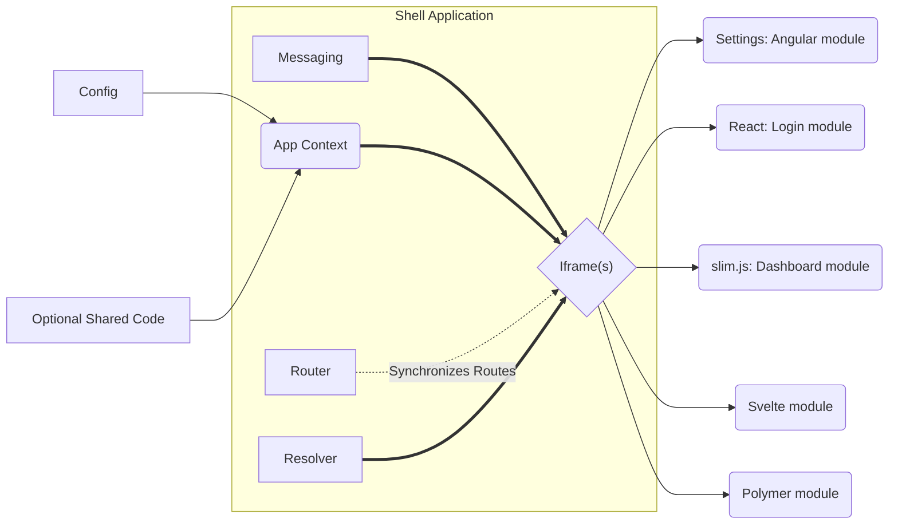

# Microfronts
## Micro Front-Ends Shell and Orchestrator
### 🛠️ In Development 🛠️

**microfronts** is a multiple front-end applications orchestrator, adds structure to complex project and eases development of multiple frontends as one in terms of user experience.

A Single config file with description of the apps, their origin and their valid routes will orchestrate on runtime and switch between apps (without re-load), or handle side-by-side.

A shared smart application context is injected on runtime and enables different front-ends to work together, send messages, references and even provide services to each other, allowing developers to write the services in one or more front-ends, or as part of the shell.

Example



And this will produce a flow chart:

```mermaid


